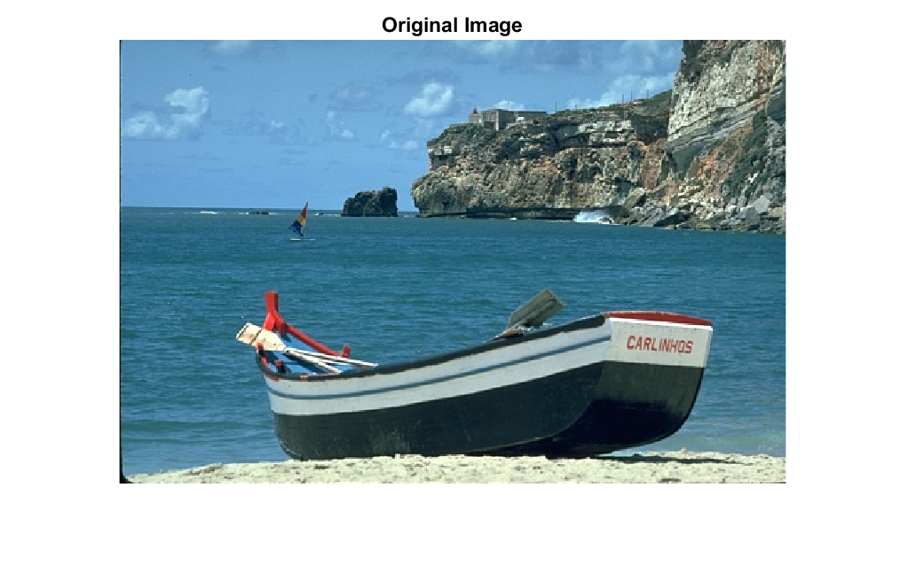
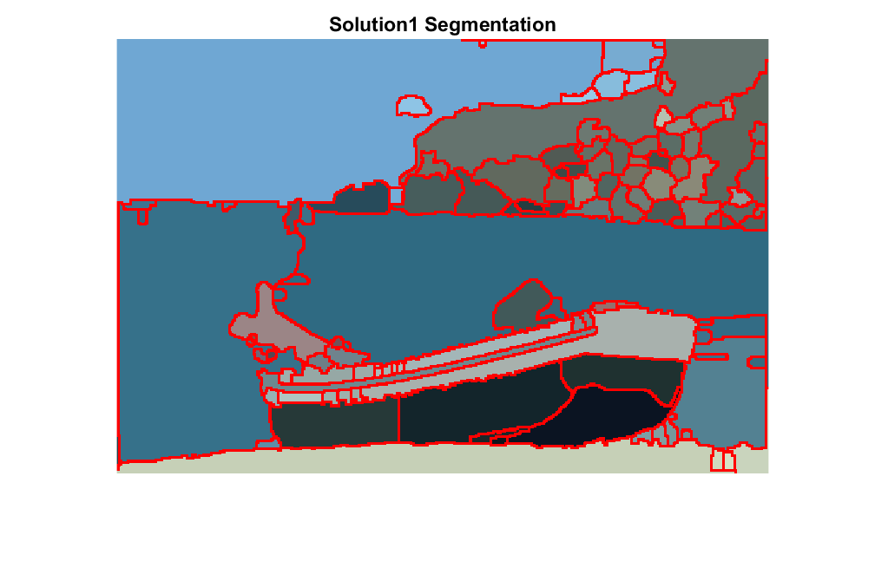
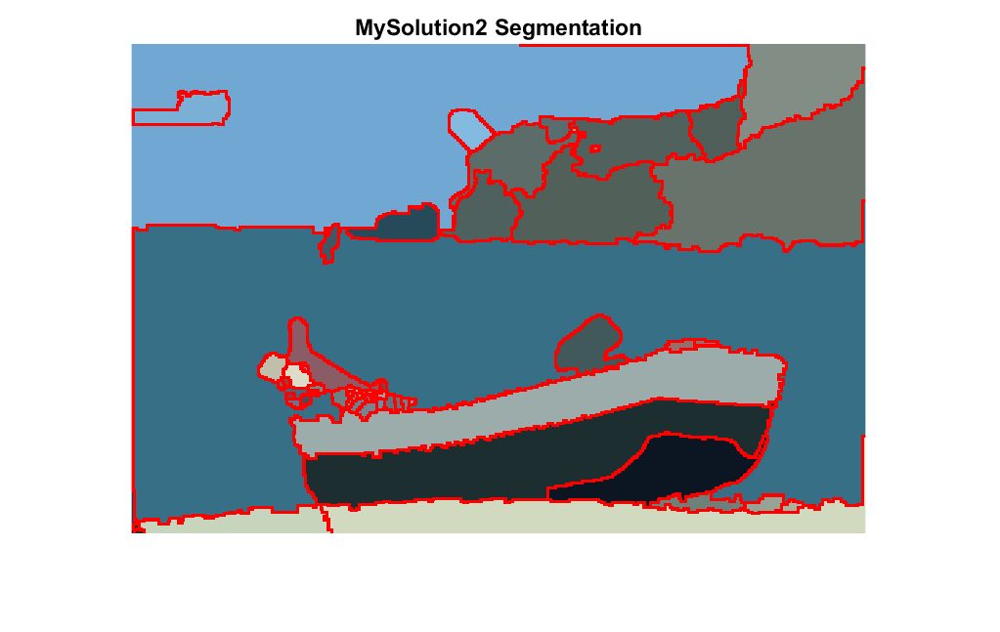

# HMEGS
# MATLAB Image Segmentation HMEGS Project

## Prerequisites
- MATLAB (with Image Processing Toolbox)

## Folder Structure
```
images/        # Contains the input images
groundTruth/   # Holds the ground truth segmentation files
savedFigures/  # Stores visualization results
myresult/      # Saves final segmentation outputs
code/          # Contains utility functions and segmentation algorithms
```

## Dataset
The BSDS500 dataset is used in this project. The dataset can be accessed from:
[BSDS500 dataset](https://example.com/docs](https://github.com/seyed-mohammadreza-mousavi/HMEGS-BSDS500-Dataset/tree/main)

## Usage
1. Place input images in the `images/` folder.
2. Place ground truth files in `groundTruth/`.
3. Run `main.m` to execute segmentation.
4. Results will be saved in `savedFigures/` and `myresult/`.

## Segmentation Methods
- **AMR-WT**: Adaptive Multiscale Reconstruction-based Watershed Transform.
- **EMF+**: Edge Mark Fill Plus method.
- **Solution1 & Solution2**: Custom segmentation approaches.

## Sample Output
- Processed images and segmentation results are saved as PNG files in the `savedFigures/` directory.
- Segmentation masks are stored as `.mat` files in the `myresult/` directory.
   
   
   

## Author
S.B. Hossaini, S.M. Mousavi, A. Bavafatoosi
